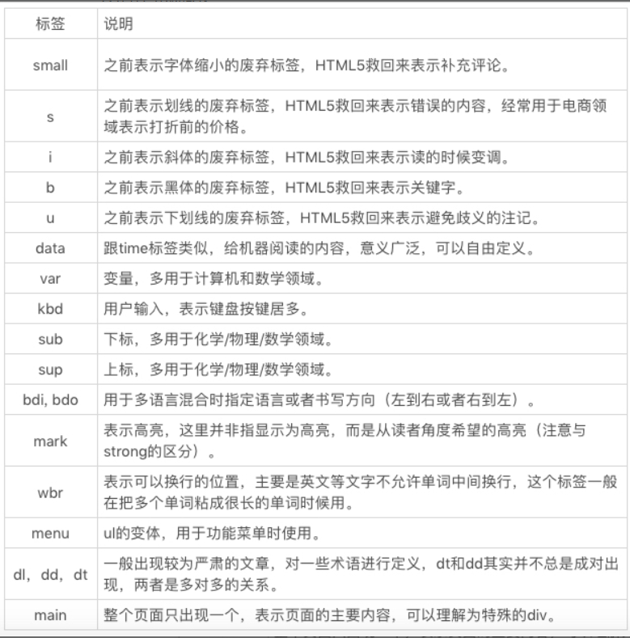

 section 标签，这个标签可不仅仅是一个“有语义的 div”，它会改变 h1-h6 的语义。section 的嵌套会使得其中的 h1-h6 下降一级，因此，在 HTML5 以后，我们只需要 section 和 h1 就足以形成文档的树形结构

 ```jsx
<section>
    <h1>HTML语义</h1>
    <p>balah balah balah balah</p>
    <section>
        <h1>弱语义</h1>
        <p>balah balah</p>
    </section>
    <section>
        <h1>结构性元素</h1>
        <p>balah balah</p> 
    </section>
......
</section>


<body>
    <header>
        <nav>
            ……
        </nav>
    </header>
    <aside>
        <nav>
            ……
        </nav>
    </aside>
    <section>……</section>
    <section>……</section>
    <section>……</section>
    <footer>
        <address>……</address>
    </footer>
</body>


// 一个典型的场景是多篇新闻展示在同一个新闻专题页面中，这种类似报纸的多文章结构适合用 article 来组织。
<body>
    <header>……</header>
    <article>
        <header>……</header>
        <section>……</section>
        <section>……</section>
        <section>……</section>
        <footer>……</footer>
    </article>
    <article>
        ……
    </article>
    <article>
        ……
    </article>
    <footer>
        <address></address>
    </footer>
</body>
 ```
还有`pre` `code` `img`相关（`figure`, `figcaption`）`time` 等等 尽量用对，否则不用
 


# css